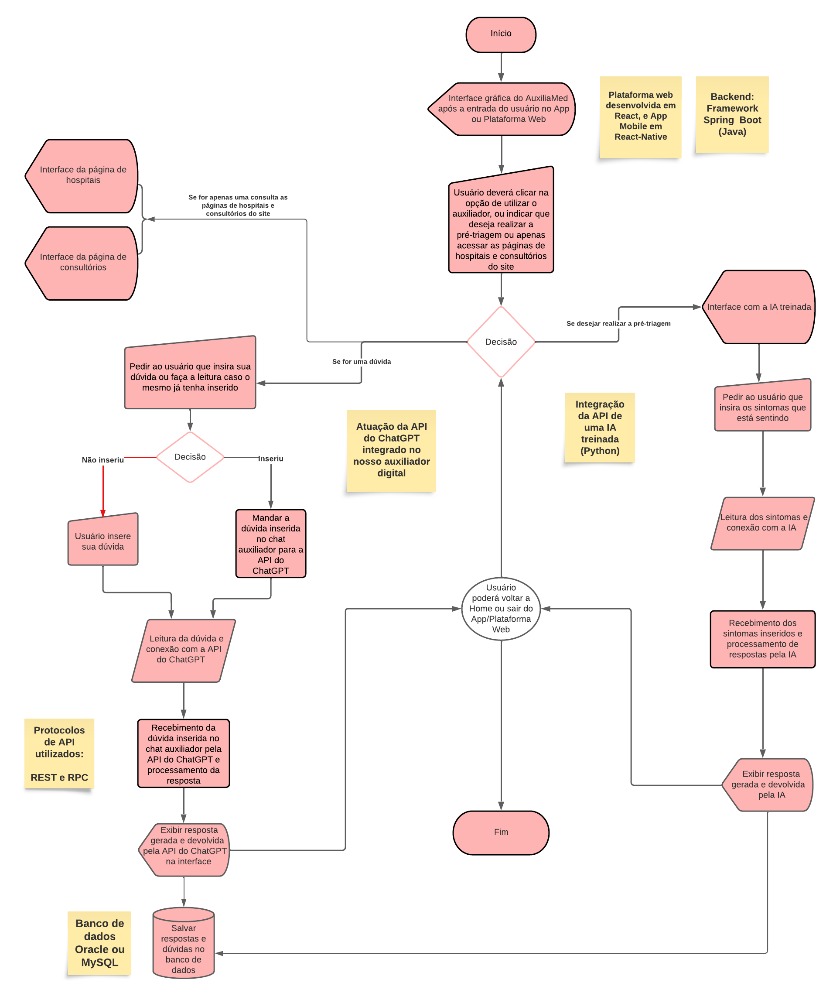

# AuxiliaMed
App e plataforma web pensados especialmente para auxiliar pessoas idosas, facilitando no acesso aos recursos dos meios digitais de saúde.

## Objetivo e escopo do projeto:
### Tema escolhido
Otimização do acesso por meios digitais á informações médicas de modo eficaz, menos burocrático e de maneira confiável, pensando especialmente nos problemas que as pessoas da terceira idade enfrentam.

### Descrição do problema
Quando se pensa em questões relacionadas a área de saúde envolvendo os meios digitais e a infraestrutura de T.I, é notável que ainda existem diversos problemas a serem solucionados relacionados ao acesso a informações médicas de modo confiável, rápido, menos burocrático e eficaz. Com base em análises, percebemos que uma grande quantidade de pessoas, especialmente as de idade avançada, apresentam dificuldades de navegação na utilização dos meios digitais de saúde, pois é nesta fase que segundo a pedagoga e mestre em Tecnologias da Inteligência e Design Digital pela Pontifícia Universidade Católica de São Paulo (PUC-SP) Kely Cristina Pereira Vieira: “Está é uma fase da vida que muitas delas começam a apresentar dificuldade em memorizar o passo a passo para acessar os softwares e aplicativos, por isso precisam de uma sequência bem determinada para aprender”, com isso, pensando especialmente na área de saúde, muitas delas por exemplo, enfrentam dificuldades na hora de navegar e utilizar os meios digitais de hospitais e consultórios que frequentam. Em vista deste problema, pensamos em uma solução para ajudar a amenizar este cenário.

### Solução encontrada e funcionamento
Com base em discussões e reuniões de ideias, nós encontramos um meio de solucionar este problema através da criação de uma plataforma web de saúde simplificada, que haverá páginas que contenham informações passo a passo sobre hospitais, consultórios e upas localizados no estado de São Paulo, além de informações e dicas sobre saúde e bem-estar. Também haverá um auxiliador digital, que será uma interface de chat, capaz de capitar as dúvidas inseridas pelo usuários e devolver as respostas com ajuda da API do ChatGPT. 

### Diagrama/Fluxograma da solução




---

## Endpoint: Cadastro de Hospitais

- Cadastro de hospitais
- Detalhar cadastro
- Apagar cadastro
- Editar cadastro

`POST` AuxiliaMed/api/v1/hospital

**Exemplo de Entrada**

```js
{
    "hospital_id": 1,
    "nm_hospital": "Hospital Sírio-Libanês",
    "hp_login": "Para fazer o login, você terá que clicar no icone localizado na parte superior do site...",
    "hp_cadastro": "Para realizar o seu cadastro, no menu superior do site, clique....",
    "hp_consulta": "Para marcar uma consulta, na primeira página  do site, embaixo da foto do hospital, clique...",
    "hp_localidade": "Localizado na Rua Antônio Sérgio, 130, Brás"
}
```

**Campos de Requisição**

| Campo | Obrigatório | Tipo  | Descrição |
|-------|:-------------:|-------|-----------|
|hospital_id|sim|int| o id do hospital cadastrado
|nm_hospital|sim|String| o nome do hospital
|hp_login|sim|String| detalhes para realização do login passo a passo, deve possuir até 4000 caracteres
|hp_cadastro|sim|String| detalhes para realização do cadastro passo a passo, deve possuir até 4000 caracteres
|hp_consulta|sim|String| detalhes de como marcar uma consulta passo a passo, deve possuir até 4000 caracteres
|hp_localidade|sim|String| detalhes da localidade do hospital, deve possuir até 4000 caracteres


**Códigos da Resposta**

|código|descrição
|-|-
201 | o hospital foi cadastrado com sucesso
400 | os dados enviados são invalidos

---

### Detalhar Hospitais

`GET` AuxiliaMed/api/v1/hospital/{id}


**Exemplo de Resposta**

***Hospital ID: 1***
```js
{
    "hospital": {
        "id": 1,
        "nm_hospital": "Hospital Sírio-Libanês",
        "hp_login": "Para fazer o login, você terá que clicar no icone localizado na parte superior do site...",
        "hp_cadastro": "Para realizar o seu cadastro, no menu superior do site, clique....",
        "hp_consulta": "Para marcar uma consulta, na primeira página  do site, embaixo da foto do hospital, clique...",
        "hp_localidade": "Localizado na Rua Antônio sérgio, 130, Brás"
    }
}
```
***Hospital ID: 2***
```js
{
    "hospital": {
        "id": 2,
        "nm_hospital": "Rede  D´or São Luiz",
        "hp_login": "Para fazer o login, você terá que clicar no icone localizado na parte superior do site...",
        "hp_cadastro": "Para realizar o seu cadastro, no menu superior do site, clique....",
        "hp_consulta": "Para marcar uma consulta, na primeira página  do site, embaixo da foto do hospital, clique...",
        "hp_localidade": "Localizado na rua Av. São Rafael, 2152 - São Marcos, Salvador"
    }
}
```

**Códigos da Resposta**

|código|descrição
|-|-
200 | os dados do hospital foram retornados
404 | não existe hospital com o ID

---

## Endpoint: Cadastro de Consultórios
- Cadastro de consultórios
- Detalhar consultoria
- Apagar consultoria
- Editar consultoria

`POST` AuxiliaMed/api/v1/consultorio

**Exemplo de Entrada**

```js
{
    "consultorio_id": 1,
    "nm_consultorio": "Dr.Consulta",
    "ct_login": "Para fazer o login, você terá que clicar no icone localizado na parte superior do site...",
    "ct_cadastro": "Para realizar o seu cadastro, no menu superior do site, clique....",
    "ct_consulta": "Para marcar uma consulta, na primeira página  do site, embaixo da foto do hospital, clique...",
    "ct_localidade": "Localizado na Rua Antônio Sérgio, 150, Brás"
}
```

**Campos de Requisição**

| Campo | Obrigatório | Tipo  | Descrição |
|-------|:-------------:|-------|-----------|
|consultorio_id|sim|int| o id do consultório cadastrado
|nm_consultorio|sim|String| o nome do consultório
|ct_login|sim|String| detalhes para realização do login passo a passo, deve possuir até 4000 caracteres
|ct_cadastro|sim|String| detalhes para realização do cadastro passo a passo, deve possuir até 4000 caracteres
|ct_consulta|sim|String| detalhes de como marcar uma consulta passo a passo, deve possuir até 4000 caracteres
|ct_localidade|sim|String| detalhes da localidade do hospital, deve possuir até 4000 caracteres

**Códigos da Resposta**

|código|descrição
|-|-
201 | o dados do consultório foram cadastrados com sucesso
400 | os dados enviados são invalidos

---

### Detalhar Consultório

`GET` AuxiliaMed/api/v1/consultorio/{id}


**Exemplo de Resposta**

***Consultório ID: 1***
```js
{
    "consultorio": {
        "id": 1,
        "nm_consultorio": "Dr.Consulta",
        "ct_login": "Para fazer o login, você terá que clicar no icone localizado na parte superior do site...",
        "ct_cadastro": "Para realizar o seu cadastro, no menu superior do site, clique....",
        "ct_consulta": "Para marcar uma consulta, na primeira página  do site, embaixo da foto do hospital, clique...",
        "ct_localidade": "Localizado na Rua Antônio Sérgio, 150, Brás"
    }
}
```
***Consultório ID: 2***
```js
{
    "consultorio": {
        "id": 2,
        "nm_consultorio": "Instituto Bem-Estar",
        "ct_login": "Para fazer o login, você terá que clicar no icone localizado na parte superior do site...",
        "ct_cadastro": "Para realizar o seu cadastro, no menu superior do site, clique....",
        "ct_consulta": "Para marcar uma consulta, na primeira página  do site, embaixo da foto do hospital, clique...",
        "ct_localidade": "Localizado na Rua John Harrison, 47 – Lapa"
    }
}
```

**Códigos da Resposta**

|código|descrição
|-|-
200 | os dados do consultório foram retornados
404 | não existe consultorio com o ID 

---

## Endpoint: Cadastro de Doenças
- Cadastro de doenças
- Detalhar doenças
- Apagar doenças
- Editar doenças

`POST` AuxiliaMed/api/v1/doenca

**Exemplo de Entrada**

```js
{
    "doenca_id": 1,
    "nm_doença": "Cancêr",
    "ds_doença": "É um tipo de doença maligna que têm como caracteristica o crescimento desordenado de células, que podem invadir tecidos adjacentes ou órgãos a distância."
}
```

**Campos de Requisição**

| Campo | Obrigatório | Tipo  | Descrição |
|-------|:-------------:|-------|-----------|
|doenca_id|sim|int| o id da doença cadastrada
|nm_doença|sim|String| o nome da doença
|ds_doença|sim|String| detalhes da doença, deve possuir até 5000 caracteres

**Códigos da Resposta**

|código|descrição
|-|-
201 | o dados da doença foram cadastrados com sucesso
400 | os dados enviados são invalidos

---

### Detalhar Doenças

`GET` AuxiliaMed/api/v1/doenca/{id}


**Exemplo de Resposta**

***Doença ID: 1***
```js
{
    "doenca": {
        "id": 1,
        "nm_doença": "Cancêr",
        "ds_doença": "É um tipo de doença maligna que têm como caracteristica o crescimento desordenado de células, que podem invadir tecidos adjacentes ou órgãos a distância."
    }
}
```
***Doença ID: 2***
```js
{
    "doenca": {
        "id": 2,
        "nm_doença": "Cirrose",
        "ds_doença": "A cirrose é uma condição em que algumas células do fígado são destruídas ou deixam de funcionar corretamente, resultando na formação de cicatrizes, fibroses e nódulos no tecido e fazendo com que o fígado tenha seu funcionamento comprometido ou parcialmente afetado."
    }
}
```

**Códigos da Resposta**

|código|descrição
|-|-
200 | os dados da doença foram retornados
404 | não existe doença com este nome 
